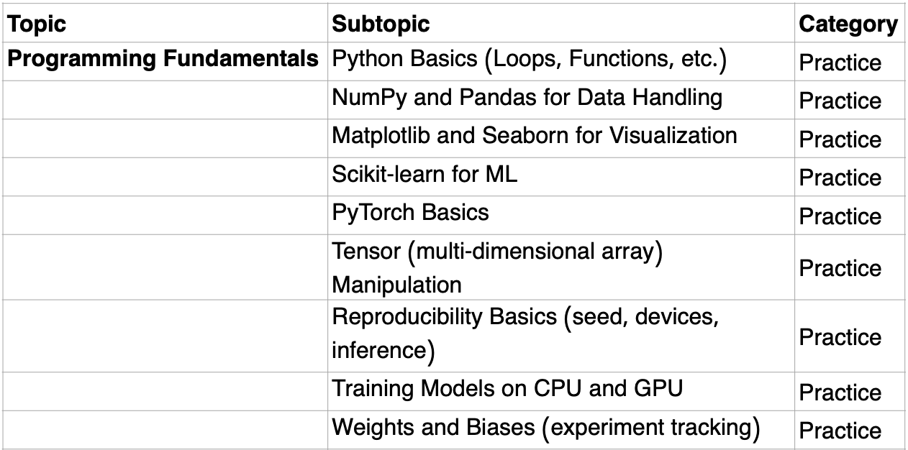

## AI Programming in Python

### Unit Overview:

### Topics: (from [syllabus](https://www.usaaio.org/syllabus))

- Python
- NumPy
- pandas
- matplotlib.pyplot
- seaborn
- scikit-learn

(from IOAI-Syllabus-2025-Final.pdf)

**BeaverEdge **[**AI 210**](https://www.beaver-edge.ai/courses#comp-m5zwh0uw__item-m50a3i5t)** - Coding for AI 1 - Advanced Python Techniques and Fundamental AI Libraries**

- Self-paced: $400; Super Instructor-paced: $1000

### Course contents:

- Advanced Python techniques for AI
- NumPy
- Pandas
- Matplotlib
- Seaborn

**Prerequisite test: Click **[**here**](https://www.beaver-edge.ai/_files/ugd/87b792_6bd09d9e6c234885869be7bbb1035837.pdf)\*\* \*\*

**FAQs Click **[**here**](https://www.beaver-edge.ai/courses#comp-m5p2nkif1)

FAQs for AI 210
The prerequisite for this course is that students need to know the fundamentals of Python. However, this description is too vague. What exactly does "fundamentals" mean?

​​

When we say "fundamental," we mean that you only need to know the basics of Python before taking this course. There is no requirement to be familiar with advanced topics or techniques in Python. To be more specific, if you can understand the topics and answer questions from the following chapters in the W3Schools Python Tutorial, you are well-prepared to enroll in our class:

​

Python Syntax: https://www.w3schools.com/python/python_syntax.asp

Python Comments: https://www.w3schools.com/python/python_comments.asp

Python Variables: https://www.w3schools.com/python/python_variables.asp

Python Data Types: https://www.w3schools.com/python/python_datatypes.asp

Python Numbers: https://www.w3schools.com/python/python_numbers.asp

Python Casting: https://www.w3schools.com/python/python_casting.asp

Python Strings: https://www.w3schools.com/python/python_strings.asp

Python Booleans: https://www.w3schools.com/python/python_booleans.asp

Python Operators: https://www.w3schools.com/python/python_operators.asp

Python Lists: https://www.w3schools.com/python/python_lists.asp

Python Tuples: https://www.w3schools.com/python/python_tuples.asp

Python Sets: https://www.w3schools.com/python/python_sets.asp

Python Dictionaries: https://www.w3schools.com/python/python_dictionaries.asp

Python If-Else: https://www.w3schools.com/python/python_conditions.asp

Python For Loops: https://www.w3schools.com/python/python_for_loops.asp

Python Functions: https://www.w3schools.com/python/python_functions.asp

Python Lambda: https://www.w3schools.com/python/python_lambda.asp

By understanding these topics, you will be fully prepared to succeed in our course.

​​

What is the relationship between this course and USACO training courses?

​

Although both USAAIO and USACO involve coding tasks, these two Olympiads require completely different coding skills.

​

First, all coding tasks in USAAIO must be completed using Python. By contrast, in USACO, when you advance to higher divisions, such as Gold, you typically need to use C++.

​

Second, in USAAIO, you need to know how to work with AI-related libraries in Python, such as NumPy, pandas, matplotlib, and seaborn. However, these libraries are not part of USACO.

​

Therefore, enrolling in this course does not require any prior experience with USACO. For those who have participated in USACO, you can still take this course as long as you are familiar with the basics of Python.

Additionally, this course is valuable even for students with USACO experience because the AI-focused libraries and coding skills taught here are not covered in USACO but are essential for success in the AI Olympiad.

Takeaways after completing this course (20 hours)

- Be ready to earn Honor Rolls in USAAIO Round 1
- Be ready to take
  - AI 300 Machine Learning 1

resx:

- [https://colab.research.google.com/github/Nyandwi/machine_learning_complete/blob/main/0_python_for_ml/intro_to_python.ipynb#scrollTo=9-vGtxIWCOEc](https://colab.research.google.com/github/Nyandwi/machine_learning_complete/blob/main/0_python_for_ml/intro_to_python.ipynb#scrollTo=9-vGtxIWCOEc)
- [Python AI Programming Course | Learn Python AI | Udacity](https://www.udacity.com/course/ai-programming-python-nanodegree--nd089) - AI Programming with Python
- [https://app.datacamp.com/learn/career-tracks/associate-data-scientist-in-python](https://app.datacamp.com/learn/career-tracks/associate-data-scientist-in-python)
