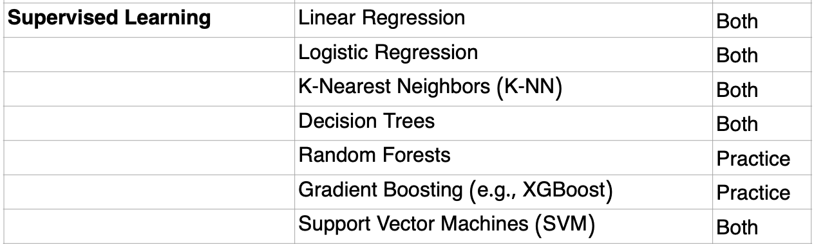
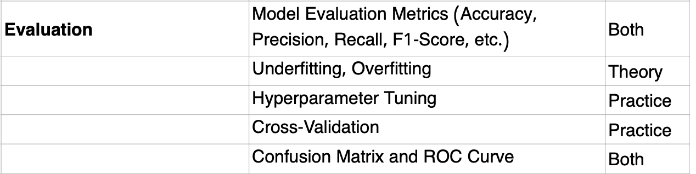

## Machine Learning: Supervised Learning

> Disclaimer: This repository contains self-authored self-study material and is neither officially affiliated with, endorsed by, nor sourced from official resources of **IOAI**, **USAAIO**, or **BeaverEdge**.

### Unit Overview:

### Topics: (from [syllabus](https://www.usaaio.org/syllabus))

- Supervised learning (e.g., linear regression, logistic regression, support vector machine, decision trees, kNN, ensemble learning, bias-variance tradeoff, cross-validation, loss functions)

(from IOAI-Syllabus-2025-Final.pdf)

**BeaverEdge **[**AI 300**](https://www.beaver-edge.ai/courses#comp-m5zwh0uw__item-m50a8inf)** - Machine Learning 1
**Self-paced: $500

### Course contents:

- Linear regression
- Bias-variance trade-off
- Regularization
- Kernel methods
- k-nearest neighbors
- Cross validation
- Logistics regression

FAQs for AI 300
What prerequisites are required prior to taking AI 300?

​​​

Students need to know AI 200 and AI 210 prior to enrolling in AI 300.

​

First, AI 300 assumes that students have necessary mathematical backgrounds, such as linear algebra, optimization and probability. In AI 300, we treat machine learning models in a rigorous way. For instance, in the linear regression model, we comprehensively use linear algebra and optimization to derive the formula of the mean-squared error estimator. Students who lack necessary math backgrounds will be lost even in our first class.

​

Second, AI 300 assumes that students have necessary coding background, particularly NumPy. For instance, we need to make a variety of manipulations of multi-dimensional NumPy arrays, such as swapping two dimensions, reshaping an array, and doing broadcasting. Students are required to program every machine learning model from scratch by using NumPy. Therefore, NumPy is a prerequisite.

S

For those machine learning models covered in AI 300, do students learn how to mathematically derive them, or how to program them?

​​​

Both are required. The rule of thumb is that we start from the first principle. For instance, while teaching students logistic regression model, we start from teaching students how to formulate the problem as a mathematical optimization problem. To use gradient descent algorithm to solve it, we teach students to derive its gradients. After completing these math tasks, we then use these results to program from scratch to build a logistic regression model.

​

Do I need to know Sklearn prior to taking AI 300?

​​​

No. This is not a prerequisite.

​

First, our course emphasizes on the first principle that students need to build all machine learning models from scratch without using any high-level API, such as Sklearn, that students can use without even knowing the mechanism behind those models.

​

Second, in AI 300, after teaching each model, we will show students the implementation of that model in Sklearn. This allows us to check results generated from both our own model and Sklearn to ensure that our model is correct. In this step, students can quickly learn how to use Sklearn.

​

Is AI 300 a prerequisite of taking any deep learning course?

​​​

The answer is mixed, both yes and no.

​

The reason of saying "yes" is as follows.

​

If you have sufficient time to prepare for AI Olympiads (at least half a year), we recommend you to take AI 300 prior to taking deep learning courses.

First, some methods and concepts in deep learning are learned in AI 300, such as cross entropy, overfitting.

​

Second, AI 300 is a good chance to improve student's skills of using math and NumPy to do AI.

​

The reason of saying "no" is as follows.

​

First, many topics in deep learning are not based on classical machine learning models. Second, most deep learning models require students to program in PyTorch (covered in AI 310), not NumPy.

​

To summarize, if you have at least half of year to prepare for AI Olympiads, we suggest you to learn AI 300 and deep learning courses (such as AI 410) in order. Otherwise, if time is too short for you, then you may consider to take both AI 300 and deep learning courses together.

Takeaways after completing this course (20 hours)

- Be on the half way of earning High Honor Rolls in USAAIO Round 1
- Be ready to take
  - AI 400 Machine Learning 2

resx:

- [Machine Learning Specialization - DeepLearning.AI](https://www.deeplearning.ai/courses/machine-learning-specialization/)
  - [Machine Learning](https://www.coursera.org/specializations/machine-learning-introduction)
- Stanford CS229: [https://cs229.stanford.edu/](https://cs229.stanford.edu/)
  - Autumn 2018 - Andrew Ng - [Stanford CS229: Machine Learning Course, Lecture 1 - Andrew Ng (Autumn 2018)](https://www.youtube.com/watch?v=jGwO_UgTS7I&list=PLoROMvodv4rMiGQp3WXShtMGgzqpfVfbU)
  - Summer 2019 - Anand Avati - [Stanford CS229: Machine Learning Course | Summer 2019 (Anand Avati)](https://www.youtube.com/playlist?list=PLoROMvodv4rNH7qL6-efu_q2_bPuy0adh)
  - Spring 2022 - Tengyu Ma, Chris Ré - [Stanford CS229: Machine Learning I Spring 2022](https://www.youtube.com/playlist?list=PLoROMvodv4rNyWOpJg_Yh4NSqI4Z4vOYy)
  - [https://cs229.stanford.edu/main_notes.pdf](https://cs229.stanford.edu/main_notes.pdf)
- [Introduction to Pytorch Machine Learning | Udacity](https://www.udacity.com/course/intro-to-machine-learning-nanodegree--nd229)
- [https://app.datacamp.com/learn/career-tracks/machine-learning-scientist-with-python](https://app.datacamp.com/learn/career-tracks/machine-learning-scientist-with-python)
  - [https://app.datacamp.com/learn/skill-tracks/supervised-machine-learning-in-python](https://app.datacamp.com/learn/skill-tracks/supervised-machine-learning-in-python)
- [Machine Learning with PyTorch and Scikit-Learn: Develop machine learning and deep learning models with Python](https://www.amazon.com/Machine-Learning-PyTorch-Scikit-Learn-learning/dp/1801819319)
- [The StatQuest Illustrated Guide To Machine Learning](https://www.amazon.com/StatQuest-Illustrated-Guide-Machine-Learning/dp/B0BLM4TLPY) - [Machine Learning](https://www.youtube.com/playlist?list=PLblh5JKOoLUICTaGLRoHQDuF_7q2GfuJF)
