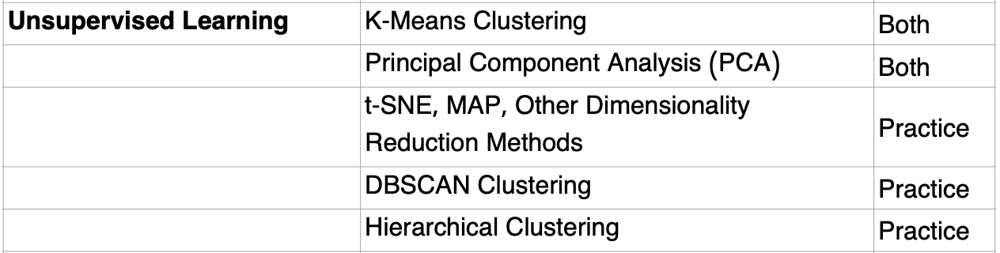
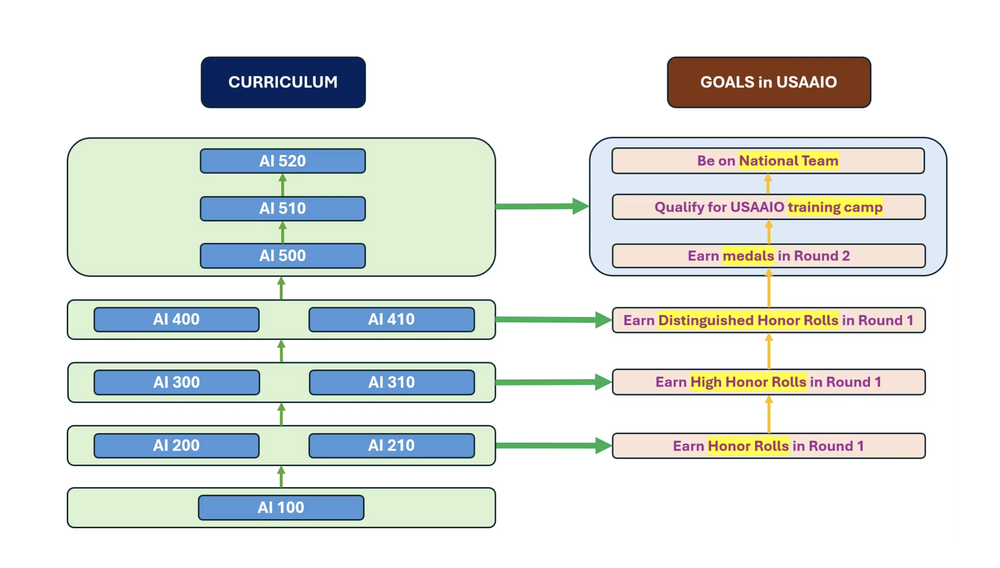

## Machine Learning: Unsupervised Learning

### Unit Overview:

### Topics: (from [syllabus](https://www.usaaio.org/syllabus))

- Unsupervised learning (e.g., k-means clustering, principal component analysis)

(from IOAI-Syllabus-2025-Final.pdf)

**BeaverEdge **[**AI 400**](https://www.beaver-edge.ai/courses#comp-m5zwh0uw__item-m50bjolt)** - Machine Learning 2
**Self-paced: $600

### Course contents:

- Support vector machines
- Decision trees
- Random forests
- Boosting
- Dimensionality reduction
- Principal component analysis
- t-SNE
- UMAP
- k-means clustering
- Semi-supervised learning

Takeaways after completing this course (20 hours)

- Be on the half way of earning Distinguished Honor Rolls in USAAIO Round 1
- Be ready to take
  - AI 410 Deep Learning and Computer Vision 1

resx:

- [https://app.datacamp.com/learn/career-tracks/machine-learning-scientist-with-python](https://app.datacamp.com/learn/career-tracks/machine-learning-scientist-with-python)
  - [https://app.datacamp.com/learn/courses/unsupervised-learning-in-python](https://app.datacamp.com/learn/courses/unsupervised-learning-in-python)
