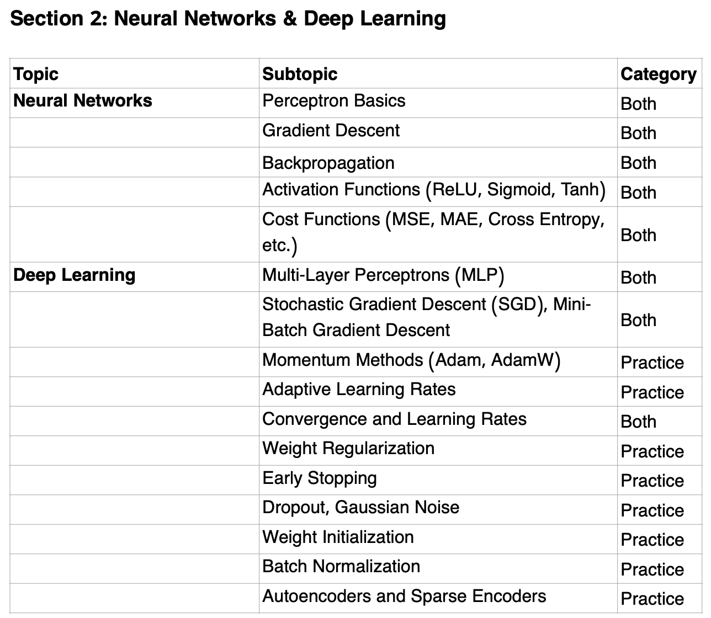

## Deep Learning

> Disclaimer: This repository contains self-authored self-study material and is neither officially affiliated with, endorsed by, nor sourced from official resources of **IOAI**, **USAAIO**, or **BeaverEdge**.

### Unit Overview:

### Topics: (from [syllabus](https://www.usaaio.org/syllabus))

- Multi-layer perceptron model​
- Essential layers (e.g., affine transformation, batch normalization, dropout)
- Forward propagation and backpropagation and their mathematical computations (by hand)

(from IOAI-Syllabus-2025-Final.pdf)

**BeaverEdge **[**AI 410**](https://www.beaver-edge.ai/courses#comp-m5zwh0uw__item-m50bstr7)** - Deep Learning and Computer Vision 1
**Self-paced: $600

### Course contents:

- Multi-layer perceptron model
- Forward propagation
- Activation functions
- Gradient descent
- Adaptive moment estimation
- Backpropagation
- Parameter initialization
- Batch normalization
- Dropout
- Convolutional layers
- Pooling layers
- Convolutional neural network
- Image data augmentation
- VGG
- ResNet
- GoogLeNet
- Transfer learning

new for 2026:

- Pretrained models
- Fine tuning

FAQs for AI 410
Why AI 300 is a prerequisite of AI 410?​​​

​

1. Deep Learning is a Subset of Machine Learning
   Machine learning is the broader field: algorithms that learn patterns from data (e.g., linear regression, decision trees, SVMs, clustering).

Deep learning is a special class within ML that uses neural networks with many layers.

Without the ML foundations, DL can feel like a black box.

2. You Need the Core Concepts
   Before deep learning, you should be comfortable with:

Supervised vs. unsupervised learning

Overfitting & underfitting

Bias–variance tradeoff

Training vs. test data, cross-validation

Evaluation metrics (accuracy, precision, recall, F1, etc.)

Deep learning models still face these same issues — just at a larger scale.

3. Understanding Optimization
   ML introduces concepts like:

Gradient descent

Loss functions

Regularization (L1, L2, dropout analogies)

These are the same mathematical ideas that DL builds upon — only with bigger networks and more parameters.

4. Data Preprocessing Skills
   Classical ML teaches you:

Feature scaling, normalization

Feature engineering

Handling missing data

In DL, raw data is more common (images, audio, text), but preprocessing and understanding feature distributions are still critical.

​​​

Why AI 310 is a prerequisite of AI 410?​​​​

​

1. Deep Learning ≠ Just Theory
   Deep learning isn’t only about math and concepts; you need to implement and experiment.

PyTorch is the main framework researchers and practitioners use to build, train, and test neural networks.

Without it (or an equivalent like TensorFlow/JAX), you’d be stuck coding all backpropagation, matrix ops, and optimization from scratch — which is impractical.

2. PyTorch Handles the Heavy Lifting
   Automatic differentiation (autograd) → you don’t manually compute gradients.

GPU acceleration → efficient large-scale training with CUDA.

Optimizers, loss functions, layers → all pre-built.
This frees you to focus on model design and research ideas, not low-level math implementation.

3. AI Olympiads, Industry, Research Standard
   USAAIO, IOAI and many other national and regional AI Olympiads require students to use PyTorch to solve deep learning problems.

Most academic papers, open-source projects, and tutorials use PyTorch.

Hugging Face (transformers, diffusers), OpenAI, Meta, and many labs release code in PyTorch.

If you want to reproduce results, extend papers, or collaborate, PyTorch literacy is expected.

​

Takeaways after completing this course (20 hours)

- Be ready to earn Distinguished Honor Rolls in USAAIO Round 1
- Be ready to take
  - AI 500 Transformers

resx:

- [https://www.coursera.org/specializations/deep-learning](https://www.coursera.org/specializations/deep-learning)
- [Deep Learning Specialization - DeepLearning.AI](https://www.deeplearning.ai/courses/deep-learning-specialization/)
  - [Deep Learning](https://www.coursera.org/specializations/deep-learning)
- [Deep Learning Online Training Course | Udacity](https://www.udacity.com/course/deep-learning-nanodegree--nd101) - https://github.com/udacity/deep-learning-v2-pytorch
- DataCamp - [https://app.datacamp.com/learn/skill-tracks/deep-learning-in-python](https://app.datacamp.com/learn/skill-tracks/deep-learning-in-python)
- [Understanding Deep Learning](https://www.amazon.com/Understanding-Deep-Learning-Simon-Prince/dp/0262048647/) - [https://x.com/SimonPrinceAI/status/1686475960973963265](https://x.com/SimonPrinceAI/status/1686475960973963265)
- [The StatQuest Illustrated Guide to Neural Networks and AI](https://www.amazon.com/StatQuest-Illustrated-Guide-Neural-Networks/dp/B0DQXYC14Q) - [Neural Networks / Deep Learning](https://www.youtube.com/playlist?list=PLblh5JKOoLUIxGDQs4LFFD--41Vzf-ME1)
- Stanford CS230: [https://cs230.stanford.edu/](https://cs230.stanford.edu/), [CS230 Deep Learning](https://github.com/cs230-stanford)
  - Autumn 2018 - [Stanford CS230: Deep Learning | Autumn 2018](https://www.youtube.com/playlist?list=PLoROMvodv4rOABXSygHTsbvUz4G_YQhOb)
- [Neural Networks: Zero to Hero](https://www.youtube.com/playlist?list=PLAqhIrjkxbuWI23v9cThsA9GvCAUhRvKZ)
