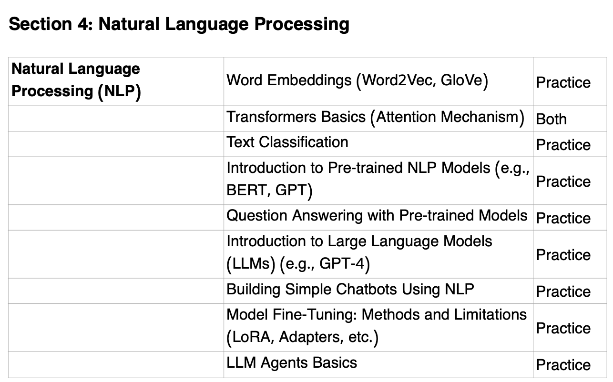

## Natural Language Processing

### Unit Overview:

### Topics: (from [syllabus](https://www.usaaio.org/syllabus))

- Tokenization​
- Word embeddings
- Transformers
- Pre-training
- Fine-tuning

(from IOAI-Syllabus-2025-Final.pdf)

**BeaverEdge **[**AI 510**](https://www.beaver-edge.ai/courses#comp-m5zwh0uw__item-m5npvwd2)** - Natural Language Processing and Graph Neural Networks**

- Self-paced: $700

### Course contents:

- Character tokenization
- Subword tokenization
- Word tokenization
- Word embedding method: Skip-gram
- Word embedding method: Continuous bag of words
- Word embedding method: Global vectors
- Encoder-only transformers: BERT
- Decoder-only transformers: GPT
- Case study: IOAI contest problems
- Message-passing neural networks

Takeaways after completing this course (20 hours)

- Be on the way of earning medals in USAAIO Round 2
- Be on the way of potentially qualify for USAAIO training camp
- Be on the way of potentially qualify for being on national team for international Olympiads
- Be ready to take
  - AI 520 Computer Vision 2 and Generative AI

resx:

- [https://web.stanford.edu/~jurafsky/slp3/](https://web.stanford.edu/~jurafsky/slp3/)
- [Natural Language Processing Specialization - DeepLearning.AI](https://www.deeplearning.ai/courses/natural-language-processing-specialization/)
  - [Natural Language Processing](https://www.coursera.org/specializations/natural-language-processing)
- [https://medium.com/towards-data-science/implementing-word2vec-in-pytorch-from-the-ground-up-c7fe5bf99889](https://medium.com/towards-data-science/implementing-word2vec-in-pytorch-from-the-ground-up-c7fe5bf99889)
- [https://www.udacity.com/course/natural-language-processing-nanodegree--nd892](https://www.udacity.com/course/natural-language-processing-nanodegree--nd892) - Natural Language Processing
- Stanford CS224N:
  - [https://web.stanford.edu/class/cs224n/](https://web.stanford.edu/class/cs224n/)
  - [https://online.stanford.edu/courses/xcs224n-natural-language-processing-deep-learning](https://online.stanford.edu/courses/xcs224n-natural-language-processing-deep-learning) - $1750
  - [https://online.stanford.edu/courses/cs224n-natural-language-processing-deep-learning](https://online.stanford.edu/courses/cs224n-natural-language-processing-deep-learning) - $6056
  - 2023 updates: [https://www.youtube.com/playlist?list=PLoROMvodv4rMFqRtEuo6SGjY4XbRIVRd4](https://www.youtube.com/playlist?list=PLoROMvodv4rMFqRtEuo6SGjY4XbRIVRd4)
  - 2022 updates - [Stanford CS224N: Natural Language Processing with Deep Learning | Winter 2021](https://www.youtube.com/playlist?list=PLoROMvodv4rOSH4v6133s9LFPRHjEmbmJ)
