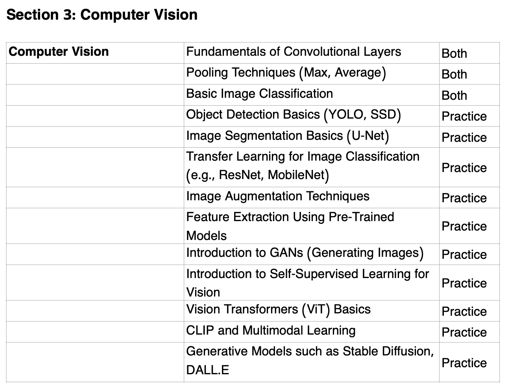

## Computer Vision

### Unit Overview:

### Topics: (from [syllabus](https://www.usaaio.org/syllabus))

- Convolutional neural network​
- Object detection
- UNet
- Autoencoder
- Variational autoencoder
- Generative adversarial network
- Denoising diffusion probabilistic models
- Stable diffusion
- Generative Modeling

new for 2026:

- Contrastive language-Image pre-training
- Adversarial attack

(from IOAI-Syllabus-2025-Final.pdf)

**BeaverEdge **[**AI 520**](https://www.beaver-edge.ai/courses#comp-m5zwh0uw__item-47ecc892-5350-47ca-923b-fa47817ced3f)** - Computer Vision 2 and Generative AI
**Self-paced: $700

### Course contents:

- Object detection
- Adversarial attack
- UNet
- Autoencoder
- Generative adversarial network
- Variational autoencoder
- Denoising diffusion probabilistic method
- Stable diffusion
- Case study: IOAI contest problems

Takeaways after completing this course (20 hours)

- Be ready to earn medals in USAAIO Round 2
- Potentially qualify for USAAIO training camp
- Potentially qualify for being on national team for international Olympiads

Resx:

- [Stanford University CS231n: Deep Learning for Computer Vision](https://cs231n.stanford.edu/)
-
- [Generative Adversarial Networks (GANs) Specialization](https://www.deeplearning.ai/courses/generative-adversarial-networks-gans-specialization/)
  - [Generative Adversarial Networks (GANs)](https://www.coursera.org/specializations/generative-adversarial-networks-gans)
- [https://www.udacity.com/course/computer-vision-nanodegree--nd891](https://www.udacity.com/course/computer-vision-nanodegree--nd891) - Computer Vision
- CS231N:
  - Winter 2016 - [CS231n Winter 2016](https://www.youtube.com/playlist?list=PLkt2uSq6rBVctENoVBg1TpCC7OQi31AlC)
  - 2017 - Fei-Fei Li and Andrej Karpathy - [Lecture Collection | Convolutional Neural Networks for Visual Recognition (Spring 2017)](https://www.youtube.com/playlist?list=PL3FW7Lu3i5JvHM8ljYj-zLfQRF3EO8sYv)
  - 2019 - Justin Johnson - [Deep Learning for Computer Vision](https://www.youtube.com/playlist?list=PL5-TkQAfAZFbzxjBHtzdVCWE0Zbhomg7r)
