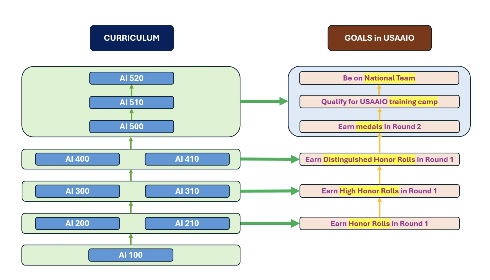

## Graph Neural Networks

> Disclaimer: This repository contains self-authored self-study material and is neither officially affiliated with, endorsed by, nor sourced from official resources of **IOAI**, **USAAIO**, or **BeaverEdge**.

### Unit Overview:

### Topics:

**BeaverEdge **[**AI 510**](https://www.beaver-edge.ai/courses#comp-m5zwh0uw__item-m5npvwd2)** - Natural Language Processing and Graph Neural Networks**

### Course contents:

- Graph convolutional networks
- Graph attention networks

resx:

- [Graph Neural Networks in Action](https://www.manning.com/books/graph-neural-networks-in-action)
- [https://uvadlc-notebooks.readthedocs.io/en/latest/tutorial_notebooks/tutorial7/GNN_overview.html](https://uvadlc-notebooks.readthedocs.io/en/latest/tutorial_notebooks/tutorial7/GNN_overview.html)
