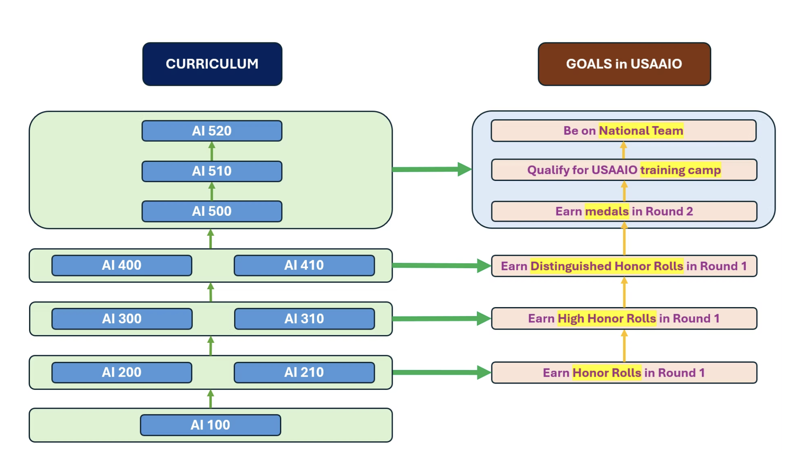

## SubjectName: **USA AI Olympiad (USAAIO)**

[Syllabus | USAAIO](https://www.usaaio.org/syllabus)

[USA AI Olympiad (@USAAIO) on X](https://x.com/USAAIO)

**2025 USA-NA-AIO: **[https://www.usaaio.org/2025-usa-na-aio](https://www.usaaio.org/2025-usa-na-aio)

- Round 1 registration
  - 02/01/2025 - 03/20/2025.
- Round 1 date, time, and location
  - March 24, 2025 (Monday), 12pm-4pm (U.S. **Eastern** Time).
    - The actual contest time is between 12:30pm and 3:30pm (U.S. Eastern Time).
    - From 12pm to 12:30pm, contestants shall set up their computers and ensure they work properly.
    - From 3:30pm to 4pm, contestants shall use this buffer time to submit their solutions and send their recording links to the contest platform.
  - Students' schools
- Round 2 date, time, and location
  - April 27, 2025 (Sunday)
  - MIT
- **USAAIO training camp**​
  - TBD​

2026 USA-NA-AIO: https://www.usaaio.org/2026-usa-na-aio

- Round 1 registration
  - July 01, 2025 - January 26, 2026.
- Round 1 date, time, and location
  - January 30, 2026 (Friday), 12pm-3pm (U.S. Eastern Time).
  - Students' schools or USAAIO's authorized test sites (such as universities, libraries, test centers).
- Round 2 date, time, and location
  - March or April, 2026.
  - MIT.
- USAAIO camp​
  - June, 2026.​
  - MIT.

---

[Syllabus | USAAIO](https://www.usaaio.org/syllabus) - [https://www.usaaio.org/syllabus](https://www.usaaio.org/syllabus)

### USAAIO Units: 

1. Markdown programming for AI
2. Mathematical Foundations for AI
3. AI Programming in Python
4. ML1 Supervised Learning
5. ML2 Unsupervised Learning
6. Deep Learning
7. Programming PyTorch
8. Natural Language Processing
9. Transformers
10. Computer Vision & Generative AI
11. Graph Neural Networks

**For the topics above, contestants should know both theory and programming.**

For example, for theory, students need to know how to derive an estimator in a linear regression model and how to prove whether a matrix is a valid kernel (that is, positive definite).

For programming, contestants need to know how to build a fully-connected neural network from scratch and the reasoning behind each step.

**A strong contestant should do well in both theory and programming.** Knowing theory without knowing how to program (e.g., do not know how to use NumPy to build a principal component analysis (PCA) class from scratch) is not good. Knowing how to program without knowing theory (e.g., only know how to use scikit-learn PCA class as a black box and do not know how the PCA eigenvalue equation is established) is also not good.

To summarize, AI Olympiad is neither a pure math Olympiad nor a pure coding Olympiad. To do well in our AI Olympiad, you need to be do well in both math and coding.

---

Practice Papers:

- USAAIO
  - some questions from the above blurb:
    - theory:
      1. derive an estimator in a linear regression model
      2. prove whether a matrix is a valid kernel (that is, positive definite)
      3. know how the PCA eigenvalue equation is established
    - practical:
      1. build a fully-connected neural network from scratch with reasoning behind each step
      2. know how to use NumPy to build a principal component analysis (PCA) class
  - [https://www.usaaio.org/samples](https://www.usaaio.org/samples)
    - [**Sample problem 1**](https://drive.google.com/file/d/1JzHq8bv0BzX5fIQh_vcnQ6QnPSwcGsB4/view?usp=sharing)
    - [**Sample problem 2**](https://drive.google.com/file/d/10ZLqSQBL_oprfynAd6ZDt1XwL84PSZPN/view?usp=sharing)
- IOAI:
  - [https://ioai-official.org/problems/](https://ioai-official.org/problems/)
  - [https://ioai-official.org/how-to-prepare/](https://ioai-official.org/how-to-prepare/) - look for the sample problems here
- IAIO
  - [https://www.iaio-official.org/competition/](https://www.iaio-official.org/competition/)

---

## Training:

### Beaver-Edge courses:

[https://www.beaver-edge.ai/courses](https://www.beaver-edge.ai/courses)

Coures and pricing (self-study / instructor-led) - [https://www.beaver-edge.ai/instructors-schedule-tuition](https://www.beaver-edge.ai/instructors-schedule-tuition)

1. AI 100 Markdown Programming for AI - $30 / $100
2. AI 200 Mathematical Methods for AI - $400 / $1000
3. AI 210 Coding for AI 1 - Advanced Python Techniques and Fundamental AI Libraries - $400 / $1000
4. AI 300 Machine Learning 1 - $500
5. AI 310 Coding for AI 2 - PyTorch - $500
6. AI 400 Machine Learning 2 - $600
7. AI 410 Deep Learning and Computer Vision 1 - $600
8. AI 500 Transformers - $700
9. AI 510 Natural Language Processing and Graph Neural Networks - $700
10. AI 520 Computer Vision 2 and Generative AI - $700
11. AI 900 Grandmaster Course - $TBD

Self-Study Total: **$5130**.

---

### Resources from other offerings:

IOAI - Official

- [https://ioai-official.org/wp-content/uploads/2025/01/Syllabus-2025-Final.pdf](https://ioai-official.org/wp-content/uploads/2025/01/Syllabus-2025-Final.pdf)

Syllabus:

- [https://ioai-official.org/how-to-prepare/](https://ioai-official.org/how-to-prepare/)
  - Python
  - PyTorch
  - Machine Learning
  - Deep Learning
  - Natural Language Processing
  - Word Embeddings
  - Transformers
  - Generative Modeling
  - Computer Vision

- [https://ioai.org.au/index.php/resources/](https://ioai.org.au/index.php/resources/)
  - [<u>1. Python</u>](https://colab.research.google.com/github/Nyandwi/machine_learning_complete/blob/main/0_python_for_ml/intro_to_python.ipynb#scrollTo=9-vGtxIWCOEc)
  - [<u>2. PyTorch</u>](https://pytorch.org/tutorials/beginner/basics/intro.html)
  - [<u>3. Machine Learning</u>](https://www.youtube.com/watch?v=jGwO_UgTS7I&list=PLoROMvodv4rMiGQp3WXShtMGgzqpfVfbU)
  - [<u>4. Deep Learning</u>](https://www.coursera.org/specializations/deep-learning)
  - [<u>5. Natural Language Processing</u>](https://web.stanford.edu/~jurafsky/slp3/)
  - [<u>6. Word Embeddings</u>](https://towardsdatascience.com/implementing-word2vec-in-pytorch-from-the-ground-up-c7fe5bf99889)
  - [<u>7. Transformers</u>](https://uvadlc-notebooks.readthedocs.io/en/latest/tutorial_notebooks/tutorial6/Transformers_and_MHAttention.html)
  - [<u>8. Generative Modeling</u>](https://github.com/karpathy/minGPT)
  - [<u>9. Computer Vision</u>](http://cs231n.stanford.edu/)
  - [<u>10. Recent Developments in CV</u>](https://uvadlc-notebooks.readthedocs.io/en/latest/index.html)

resx:

- Mathematics of Intelligences
- AI Programming in Python
- Machine Learning
- Deep Learning
- Large Language Models
- Graph Neural Networks

---
